# xHOSM — сценарии работы с интерфейсом (v2)

**Что это:** клик-пути по аудиториям — от авторизации до результата: что открывают, куда жмут, какие поля заполняют, что видят на выходе. У каждого из **36 сценариев — блок-схема**.

**Версия:** md-версия синхронна PDF («xHOSM_сценарии_интерфейса_v2.pdf»), 18.09.2026, Hermes Agent.

**Источники:** wiki «Интерфейс системы управления XHOSM», IIKOWEB «Работа с установленным ПО» и «iikoFront, iikoOffice и тд (не iikoweb)», «Разворачивание стенда Franchise», инструкции L3S (UOC, франшиза, FTP-выдача), User Stories и спека «Xhosm», сводки болей. Действия и окна — из документации; где источник не покрывает детали — помечено «(уточнить)».

## 0. Как читать

Карточка = один путь: **шаги** (что делает пользователь), затем при наличии — заметки (фолбэк, ограничения) и **схема пути**. Названия кнопок и адреса — как в системе сейчас; в новом Linux-интерфейсе сверять со стендом xhosm-test.

**Аудитории:** L3 Support (ядро), L3 Web, аналитики (RMS/Chain и данных), инфраструктура, партнёры и АМ, разработка. Вход и базовые механики — общие для всех.

**Легенда схем (Mermaid):** овал — старт/финал; прямоугольник — шаг (клик, поле, кнопка); ромб — развилка, ветки подписаны «да / нет / или». Схемы в формате Mermaid красиво отображаются на GitHub/GitLab, в Obsidian, VS Code (с расширением), Confluence; при открытии в простом текстовом просмотрщике будет виден исходник схемы.

## 1. Общее: вход и базовые механики (для всех аудиторий)

### UI-00. Вход в систему и первый экран

1. Открыть адрес своего контура: RU — http://xhosm.resto.lan · EU — https://xhosm-eu.cloud.lan · KZ — http://xhosm-kz.resto.lan (тестовые контуры нового Linux-GUI: xhosm-test / xhosm-dev).
2. Ввести доменный логин и пароль (авторизация под доменной учётной записью; внешним пользователям выдаётся отдельный доступ).
3. Панель: сверху шапка (название, «?» — вики, имя пользователя, иконки-инструменты, ряд вкладок, статус подключений, кластеры по умолчанию, версия по умолчанию, «Компоненты», дата/время, счётчики «всего / в архиве»), снизу — пустая таблица до первого поиска.
4. Клик по имени пользователя — история его операций; клик по «?» — переход в документацию.

> Что учесть: сессия ограничена по времени (≈4 ч) — при долгих разборах приходится логиниться заново; в интервью вход назван «неудобным аутентификатором» (US-028) → SSO/долгоживущая сессия. Новым людям непонятен состав панели — просили стартовую страницу-навигацию (DO-899).

**Схема пути: UI-00**

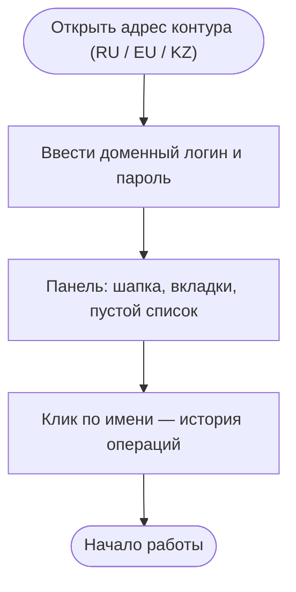

### UI-01. Поиск сервера клиента (источник всех действий)

1. Кликнуть в поле поиска (левая панель, многострочное поле).
2. Вбить значения — столбиком или через пробел, можно смешивать типы: CRM ID (точное), UID нового образца NNN-NNN-NNN (точное), домен (частичное: «zapravka», «zapravka.iiko.it», с портом/протоколом), Tomcat (точное), SQL-сервер (точное). До 1000 значений за раз.
3. Ctrl+Enter (или кнопка «Найти»).
4. Прочитать результат: по умолчанию 25 строк, счётчик найденного, флажок «Показать все», экспорт «.CSV».
5. Сузить выборку фильтрами прямо в заголовке таблицы.
6. Кнопка рядом с «Найти» (Shift+клик) — поиск «связанных»: нашли Chain — показать его RMS и наоборот.

> Что учесть: WHERE-запросы и смешивание типов — барьер для нетехнических ролей; фильтры появляются только после поиска; «Поле „Статус“ в поиске не используется» (интервью).

**Схема пути: UI-01**

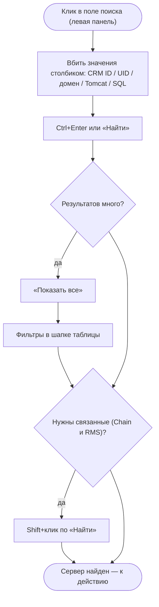

### UI-02. Работа со строкой результата («швейцарский нож»)

1. Флажок в строке — кроме выбора, включает отслеживание статуса: статус и версия тянутся с сервера (getServerMonitoringInfo.jsp), период обновления по умолчанию 60 с; на больших выборках (>100 строк) перед «выделить всё» советуют ставить обновление на OFF.
2. Опция «больше информации» — показывает память и ключевые параметры resto.properties.
3. Кнопки UID · iikoUser · Контракт — по клику значение появляется прямо вместо кнопки.
4. «История» — последние 25 операций по домену с подробностями.
5. Ссылки строки: «Контрагент» → карточка в iikoCRM; «Домен» → веб-интерфейс клиента; «Томкат» → ярлык RDP-подключения; «Логи» → лог-файлы; «SQL-сервер» → запуск SQL-студии; «Имя БД» → бекап этой БД (MSSQL → \\hosfiles\Быстрый_обмен\, PGSQL → \\hossupport\Backups\).
6. Для макросов (BackOffice, DBeaver и т.п.) — один раз настроить «параметры адаптера» (суффиксы resto.lan / cloud.lan).

> Что учесть: цвет строки — главный индикатор статуса, но статус бывает недостоверным (DO-1225: «Auto», при фокусе — «STOPPED»); строка перегружена (~23 колонки из 70+ атрибутов, DO-586).

**Схема пути: UI-02**

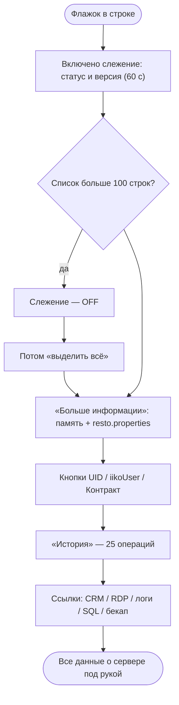

### UI-03. Планировщик: очередь, отмена, «Исполнить сейчас»

1. Иконка Scheduler в шапке — история запланированных задач (шоу) с фильтрами и группировкой (DO-1612 — сделано).
2. Крестик у задачи — отмена запланированной операции (DO-1081 — сделано).
3. «Исполнить сейчас» — протолкнуть задачу в 1 клик, не дожидаясь срока (DO-1081 — сделано).
4. Время запуска задаётся в любом модуле: Сейчас / Очередь / Тех.окно / Через 1–9 ч / ЧЧ:ММ; периодичность D/W/M/Q/Y.
5. Смотрим состав задач и их судьбу — до и после выполнения; при простое шедуллера задачи сдвигаются (DO-1098).

> Что учесть: из-за подвисаний шедуллера «часть задач не успевает выполниться в срок» (DO-1098); «дополнительное задание прилипает» — дубли авто-задач (DO-2004). Нужен центр задач: прогресс, уведомления, чистка дублей.

**Схема пути: UI-03**

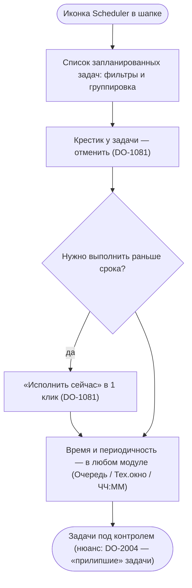

## 2. Техподдержка L3 (ядро) — самые частые пути

L3 работает «от тикета»: найти сервер → оценить состояние → выполнить операцию → проверить результат и сообщить клиенту. Ниже — клик-пути ключевых операций.

### UI-L3-01. Перезапуск / остановка сервиса (+очистка)

1. Поиск клиента (UI-01) → отметить строку флажком.
2. Модуль «Служба». При необходимости отметить опции: «Удалить лицензии» (удалит HostAccess.dat, RestrictionsState.dat, опц. LicensingState.dat), «Удалить unsaveddata», «Аварийное прерывание».
3. Выбрать время: Сейчас / Очередь / Тех.окно / Через 1–9 ч / ЧЧ:ММ; при регулярности — периодичность D/W/M/Q/Y.
4. Нажать «Остановка» (служба → Disabled) или «Перезапуск» (→ Auto).
5. Наблюдать: статус в строке (если включено отслеживание) и логи операции; дождаться завершения.

> Фолбэк: не отвечает — «Аварийное прерывание»; статус «CONTAINERCREATING» застрял — отдельный инструмент исправления статуса пода (по флажкам).

> Новому UI: прогресс и этапы долгой операции, ETA, уведомление о завершении — сейчас «процесс занимает длительное время, а никаких подробностей не предоставляется» (DO-1431).

**Схема пути: UI-L3-01**

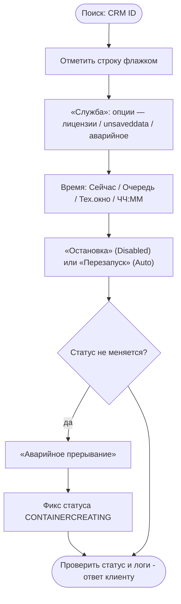

### UI-L3-02. Лицензии: отвязать / обновить / удалить / кэш

1. Способ А (по списку): поиск → отметить флажками записи → модуль «Лицензии» → кнопка «Отвязать» / «Удалить» / «Обновить» / «Обнов. кэш».
2. Способ Б (одиночный): ввести CRM ID или UID в поле над кнопками (по CRM ID быстрее; UID «старого образца» тоже принимается) → нажать соответствующую кнопку.
3. Успех: всплывает окно с сообщением, поле очищается.
4. Ветка «красный Cloud»: «upRevision» + «Обновить» → синхронизация UOC (Postman: execSyncWithCrm; админка веба: Synchronize → Flush UOC binding → Check credentials; облачко позеленело — ок).
5. Ветка «не пускает в веб-приложение» (BCrypt): Cloud Tools → «Обслуживание» → Groovy.jsp → скрипты Bcrypt part 1 и part 2 (до 5 минут; part 1 перезапускает сервер).

> Новому UI: один диагностический чек-лист «лицензия не работает» вместо цепочки xHOSM → Postman → админка; кнопки должны сообщать, что именно сделали.

**Схема пути: UI-L3-02**

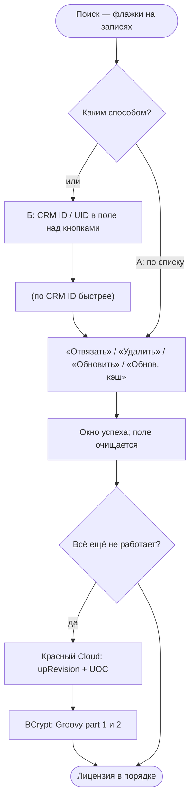

### UI-L3-03. Период редактирования документов

1. По инструкции проверить допустимость (тариф, размер БД, до 180 / свыше 180 дней, согласования).
2. Поиск → флажок на сервере.
3. Модуль «Конфигурация»: в поле «имя параметра» — db-period-length-days, в поле значения — нужное число дней.
4. Отметить опцию «перезапустить Tomcat» → «Сохранить».
5. Проверить результат: «больше информации» (период отображается), статус сервера.

> Новому UI: правила и лимиты — прямо у поля (подсказка по тарифу/сроку), статус согласований; сейчас правила живут на вики, а не в интерфейсе.

**Схема пути: UI-L3-03**

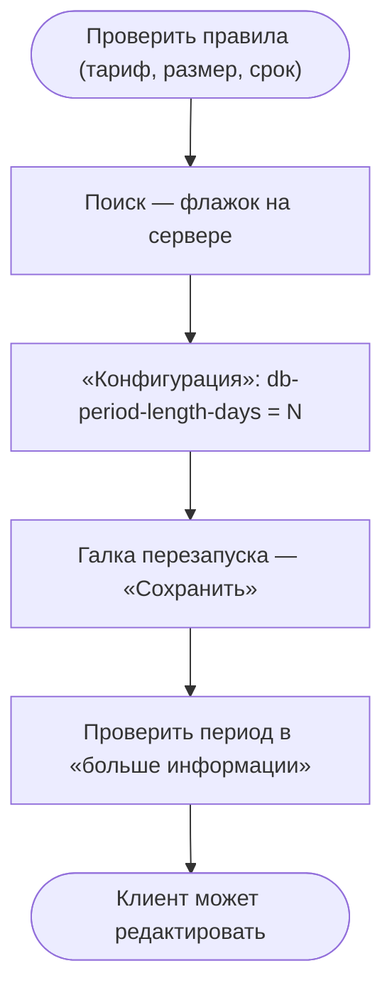

### UI-L3-04. Изменение памяти (Xmx)

1. Диагностика: «больше информации» (память), логи, метрики.
2. Поиск → флажок → «Конфигурация» → параметр memory → новое значение (кратно: 1.5×/2×).
3. «Сохранить» + перезапуск Tomcat.
4. Проверить: память в «больше информации», статус; при ОЛАП — повторная диагностика.

> Новому UI: подсказка рекомендуемого значения и объяснение ограничений (нельзя «на глаз»/уменьшать без причины — DO-343, DO-1106); калькулятор RAM из нового GUI убран.

**Схема пути: UI-L3-04**

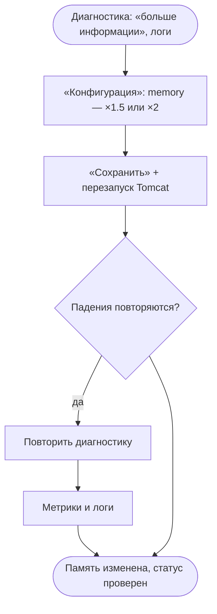

### UI-L3-05. Обновление версии

1. Поиск → отметить один или несколько серверов флажками.
2. Модуль «Версия»: выбрать версию из выпадающего списка (Branch, Beta, Бренд, Front/Office), при необходимости — опции выкладывания дистрибутивов Front/Office; флаги Downgrade / Unlock / Rapid — только осознанно.
3. Выбрать время выполнения (сейчас / очередь / тех.окно).
4. «Обновить» → наблюдать выполнение; проверить логи (PgSQL-бекапы ищутся с тильдой в имени БД на том же SQL-сервере; MSSQL-бекап — на \\hosfiles-3\quick_exchange; файлы новой версии копируются с \\mria\distriiko).
5. После обновления: обновить статус/версию в строке, сообщить клиенту.

> Нюанс: при MSSQL-БД происходит снятие с зеркалирования. Блокировка «нельзя — открытые смены» (DO-1936) — причина уточняется у разработки.

> Новому UI: видимые этапы (файлы → бекап → рестарт → ревизия) и ETA; блокировки с объяснением и способом решения.

**Схема пути: UI-L3-05**

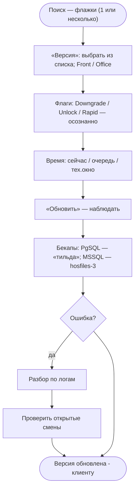

### UI-L3-06. Логи: посмотреть, найти, скачать

1. Поиск → в строке кликнуть поле «Логи» → открыть нужный файл (error / full / JMS / startup / threaddump).
2. Кнопка «V» — переход в Victoria Logs по серверу.
3. Нужен пакет для разбора — скачать ZIP (включая ротационные).
4. Сервер остановлен — смотреть Archive1/Archive2 (пишутся каждые 15 минут).

> Новому UI: встроенный поиск по всем логам клиента и live-режим («tail -F») — сейчас логи скачивают на свою машину, а докачка качает всё заново (DO-899).

**Схема пути: UI-L3-06**

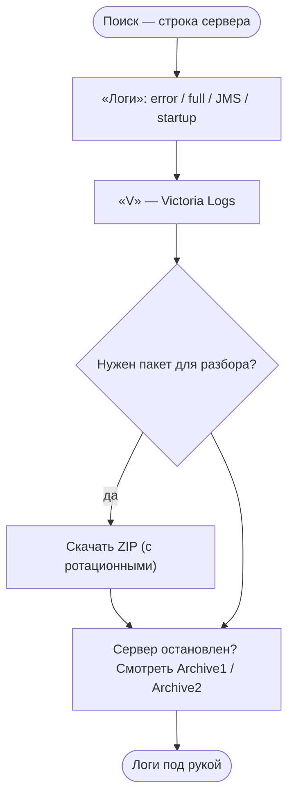

### UI-L3-07. Бекап БД

1. Остановить службу Tomcat (обязательно для бекапа/восстановления/переноса).
2. Поиск → отметить до 5 серверов флажками (ограничение из-за нагрузки; для PGSQL идёт конвертация через промежуточную MSSQL-базу).
3. Модуль «Бекап БД»: тип файла (.bak/.dmp), папка, «Архивировать после», при необходимости «Сделать бекап на FTP» (euftp.syrve.online) и «Анонимизация».
4. Запустить; сообщения о стадиях выводятся в правом верхнем углу окна; дождаться завершения.
5. Отметить «запустить Tomcat после» (или запустить вручную в «Службе»).

> Выдача партнёру: в «Обслуживании» → «Создание папки на FTP» → «Выполнить» → передать путь и доступ; логи покажут папку и креды.

> Новому UI: мастер «сделать/найти/выдать бекап», история бекапов сервера, живые ссылки (сейчас «списки находятся, а ссылки не открываются», DO-899).

**Схема пути: UI-L3-07**

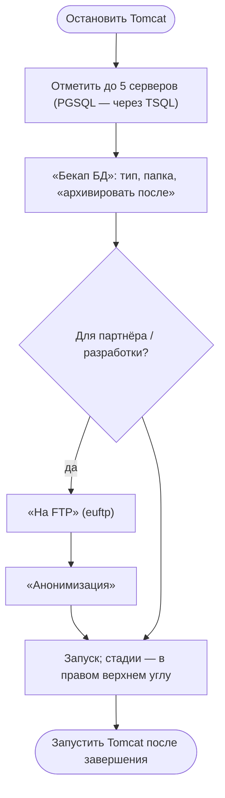

### UI-L3-08. Восстановление / перенос / копирование БД

1. Остановить Tomcat.
2. Восстановление (1 строка): выбрать файл .bak из \\hosfiles\Быстрый_обмен\ → отметить «Пересоздать БД» → «Восстановить из бекапа» → по завершении запустить Tomcat (внимание: после загрузки период станет 60 дней).
3. Перенос (до 5 строк): выбрать SQL-сервер назначения, БД назначения (пусто — не менять имя), «Пересоздать БД» → запустить; прогресс — в правом верхнем углу.
4. Внутри: MSSQL↔PGSQL — конвертация FullConvert; PGSQL→PGSQL — pg_dump/pg_restore (временный файл на HOSSUPPORT D:\Backups); MSSQL→MSSQL — sqlcmd через \\hosfiles\Быстрый_обмен\.

> Новому UI: превью плана («что будет сделано») до запуска, этапы, безопасный откат; сейчас риск (пересоздание/удаление) прикрыт только подтверждениями.

**Схема пути: UI-L3-08**

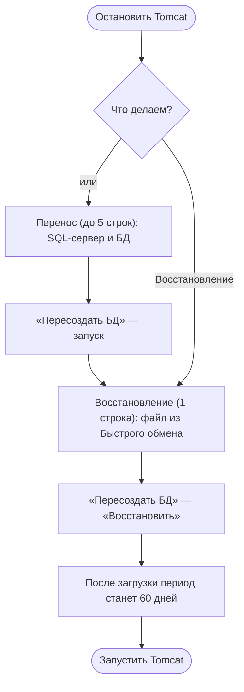

### UI-L3-09. Кассовые смены: закрыть / удалить

1. Остановить сервер («Служба» → «Остановка», дождаться статуса STOPPED; иногда нужно обновить страницу для актуализации статуса).
2. Модуль «Разное» → «Закрыть смену»: появится список открытых смен → скопировать строку UUID YYYY-MM-DD HH:MM целиком → вставить в поле → исправить дату-время закрытия → «Ок» (связанные документы переведутся в статус АЗ).
3. Если смен несколько — снять галку автозапуска Tomcat справа от кнопки, чтобы сервер не перезапускался после каждой операции.
4. «Удалить смену» — аналогично, по выбору из списка.
5. После работы — запустить Tomcat.

> Партнёрам выдают инструкцию («Закрытие смены — инструкция для партнёров» на вики).

> Новому UI: список смен с массовыми галочками и шаблонами («закрыть до даты») — сейчас «по одной ну ооочень долго», люди пишут SQL-скрипты (DO-969).

**Схема пути: UI-L3-09**

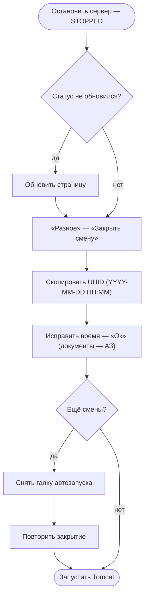

### UI-L3-10. SQL-запрос и Groovy-скрипт

1. SQL: вкладка «SQL» → ввести запрос → для записи включить флаг «Разрешить изменения» → выполнить; лимит вывода 100 строк, дальше — CSV; массовый режим — до 1500 серверов (Statistics).
2. Groovy: вкладка Cloud Tools → «Обслуживание» → Groovy.jsp → выбрать скрипт → запустить (до 5 минут; часть скриптов рестартит сервер).

> Новому UI: история и общие сохранённые запросы (сейчас «избранные SQL» не прижились — пишут заново); понятные последствия записи на боевом.

**Схема пути: UI-L3-10**

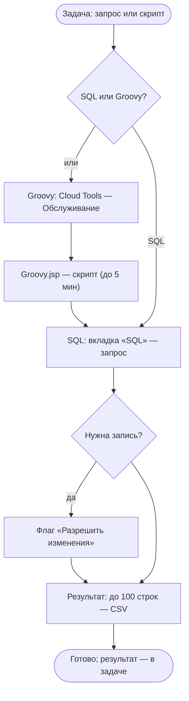

### UI-L3-11. Обрезка базы (shrink) — тяжёлый путь

1. Правило: дата обрезки не позднее начала открытого периода минус 1 год; резать последовательно (Chain → RMS), контролируя балансы.
2. Сделать ручной бекап на сервер контура.
3. Остановить сервер в xHOSM.
4. «Конфигурация»: снять галку перезапуска; прописать db-shrink-no-backup=true и db-shrink-date=YYYY-MM-DD; вернуть галку; включить db-shrink-exclusive-mode=true (эксклюзивный режим).
5. Дождаться успеха в логах (статус Complete, «balances before = after»); при ошибке действовать по тексту в логах (инструкция описывает, когда надо восстанавливать бекап).
6. Выключить эксклюзивный режим (false), запустить сервер; сделать пометку через значок «i» у сервера (комментарий о shrink).

> Новому UI: мастер shrink с проверками и автопометкой — сейчас всё вручную, включая пометку.

**Схема пути: UI-L3-11**

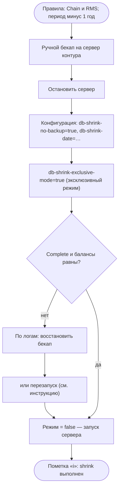

### UI-L3-12. Перевод RMS → Chain (мастер-цепочка)

1. Поиск по CRM ID (пример: RMS 3725122, Chain 6711911).
2. Отметить RMS → запустить скрипт №1 (репликация + остановка Tomcat).
3. Вкладка «Бекапы»: галочка на RMS → файл .dmp PGSQL → папка назначения по контуру (например, \\hossupport-eu\Backups) → «запустить Tomcat после»; дождаться, инфо — в окне логов.
4. Отметить Chain → указать версию → «Создать 1» (предпроверка).
5. Остановить Tomcat Chain → «Восстановить»: тип PGSQL, файл бекапа, «пересоздать БД», без автозапуска.
6. Скрипт №2 (Server Instance) → при ошибке «операция только для чейна» — «Ревизия» на 1-й вкладке → скрипт №3 после запуска сервера.

> Новому UI: превратить цепочку «кнопок №1–3» в пошаговый мастер с прогрессом и откатом.

**Схема пути: UI-L3-12**

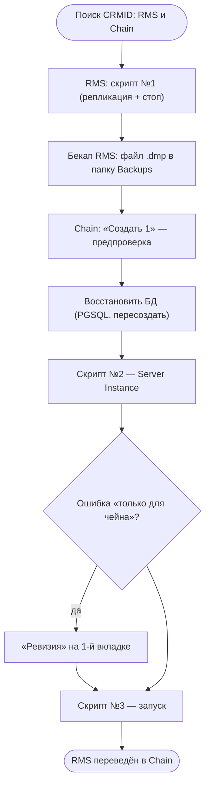

### UI-L3-13. Демо-стенд для разбора

1. partners.iiko.ru → демо-кабинеты → добавить (RMS/сеть; город РФ на этапе создания для RU).
2. Если галка «активировать сервер» не ставилась — идти в xHOSM и создать сервер вручную (поиск по UID).
3. Выбрать версию → развернуть; восстановить бекап клиента (с анонимизацией); для EU — сменить адрес в CRM на европейский, сервер определится в евро-зону.
4. Лицензия: боевая при объёмах >150 тыс. продаж.

> Новому UI: «мои демо» и избранное (DO-1311), шаблоны, срок жизни стенда.

**Схема пути: UI-L3-13**

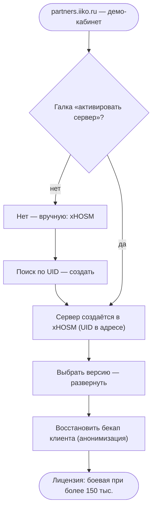

### UI-L3-14. Восстановление хостинга из архива

1. Сначала автоматика: в ЛК чейна «Распределение лицензий» → удалить лицензии с RMS → сохранить → распределить заново → сохранить (это даёт команду на автозапуск; сервера поднимаются за ~10–15 минут, worst ~1 час).
2. Если не сработало: XHOSM → найти сервер (crmid / uid / domain) → выделить галочкой → вкладка «Разное», блок «Архив» → «Восстановление» (параметр «Авто» + галка «Запустить»).

> Новому UI: показывать статус «восстанавливается из архива» с ETA, а не только менять цвет строки.

**Схема пути: UI-L3-14**

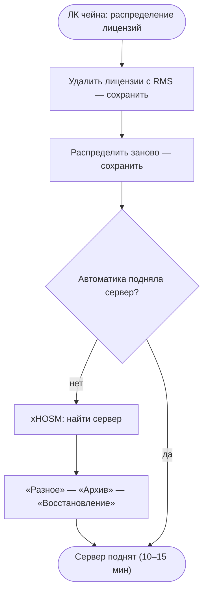

### UI-L3-15. «Красный Cloud» — синхронизация UOC

1. Найти сервер → «Лицензии» → «upRevision» → «Обновить».
2. Postman: вызвать execSyncWithCrm (POST http://uocservice.iiko.nltran.lan/api/TransportUoc/execSyncWithCrm).
3. Админка веба → UOC Organizations: по очереди Synchronize → Flush UOC binding → Check credentials.
4. Проверка: облачко стало зелёным; если нет — разбираться с клаудными лицензиями (МЕНА — свои менеджеры).
5. Глубже (при необходимости): Groovy Bcrypt part 1 (чейны) или POST resetPasswordHashes (одиночные); пароль придёт с обменом РМС–UOC в течение 10 минут.

> Новому UI: один чек-лист «красный Cloud» вместо цепочки XHOSM → Postman → админка; состояние каждого шага видно.

**Схема пути: UI-L3-15**

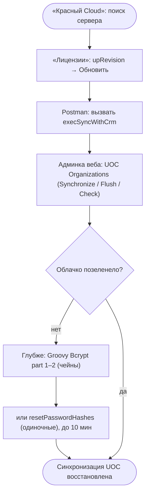

### UI-L3-16. iikoFranchise: подключение серверов к ЛК

1. «Конфигурация»: RESTOPROPPACK = FRAN_PROD0/1/2 (или FRAN_TEST0 / FRAN_EUPROD0) → «Сохранить» с перезапуском.
2. Партнёр создаёт подключение; в ЛК: «Настройки → Подключения» — в поле CRMID вписать CRMID сервера из XHOSM → выбрать пользователя → сохранить.
3. Вкладка iikoFranchise: Ctrl+F по CRMID → выбрать подключение → «Справочники» → дождаться обновления «Дата последнего получения данных».
4. Проверка обмена — по логам контура (prod-N.franchise.cloud.lan:82/logs); на стендах (QA) также franchise-replication-enabled=true и проверка resto.properties.

> Фолбэк: «Дата…» не обновляется — смотреть логи контура; ссылки на логи из XHOSM нет (DO-1684).

> Новому UI: CRMID и контур — в карточке сервера; ссылка «логи контура» из XHOSM (DO-1684).

**Схема пути: UI-L3-16**

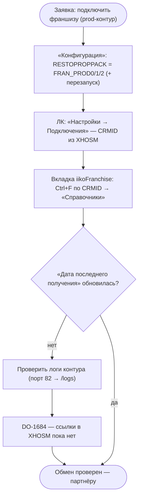

### UI-L3-17. Выдача данных партнёру/разработке (FTP + анонимизация)

1. Остановить Tomcat; «Бекап БД» — из текущей БД, архива или ночного бэкапа.
2. Флажок «на FTP-сервер» (+ «Анонимизация» — сервис backup-api для передачи наружу).
3. Файл попадает в \\mria\ftp\<СЕРВЕР>\; в сообщениях HOSSUPPORT и на почту инициатору — FTP-сервер, имя файла, логин и пароль.
4. Передать партнёру инструкцию (FileZilla / прямая ссылка); на каждый файл — новый пароль; партнёр видит все файлы папки.

> Новому UI: мастер «выдать данные»: кому / что / анонимизировать, статус доставки и срок жизни доступа (DO-1917, DO-1181).

**Схема пути: UI-L3-17**

```mermaid
flowchart TB
    n0(["Заявка партнёра/разработки на базу"])
    n1{"Откуда база?"}
    n1_r0["Текущая БД"]
    n1_r1["Архив / ночной бэкап"]
    n2["«Бекап БД»: флажок «на FTP-сервер» (+ «Анонимизация»)"]
    n3["Файл → //mria/ftp/«СЕРВЕР»; креды — в HOSSUPPORT и на почту"]
    n4["Партнёр скачивает (FileZilla / ссылка; новый пароль на файл)"]
    n5(["Данные переданы"])
    n0 --> n1
    n1 -->|"или"| n1_r0
    n1_r0 --> n1_r1
    n1_r1 --> n2
    n1 --> n2
    n2 --> n3
    n3 --> n4
    n4 --> n5
```

## 3. L3 Web

Работают по веб-модулям клиентов: смотрят логи и конфиги, чинят доступы, отслеживают состояние после операций.

### UI-W-01. Разбор веб-инцидента

1. Поиск (CRM ID/домен) → флажок на строке (включить отслеживание статуса/версии).
2. Логи: «Логи» в строке → error/full → кнопка «V» (Victoria) для глубокого поиска.
3. Конфигурация: просмотр/правка параметров resto.properties (например, якорные параметры веба) → «Сохранить» (+рестарт при необходимости).
4. Фиксы доступа (например, BCrypt) — через Groovy (UI-L3-10); после — проверить вход в веб-приложение.

> Что учесть: «Не хватало доки для работы с ошибками в xhosm» (ретро, 2025); зависимость от ручных Postman-шагов.

**Схема пути: UI-W-01**

```mermaid
flowchart TB
    n0(["Поиск: CRM ID или домен"])
    n1["Флажок — включить слежение"]
    n2["«Логи» — error / full"]
    n3["«V» — Victoria Logs"]
    n4{"Сломан доступ (например, BCrypt)?"}
    n4_r0["Groovy: Bcrypt part 1 и 2 (до 5 мин)"]
    n5(["Проверка входа в веб-приложение"])
    n0 --> n1
    n1 --> n2
    n2 --> n3
    n3 --> n4
    n4 -->|"да"| n4_r0
    n4_r0 --> n5
    n4 --> n5
```

### UI-W-02. Подключение к клиенту/стенду без установки (iikoOffice / Chain)

1. XHOSM: вставить CRM_ID ресторана в левое поле поиска → «Найти».
2. Клик по значку iikoOffice в строке → скачается файл .xhosm.
3. Открыть файл через xHosmLauncher.bat (Windows) — откроется iikoOffice выбранного ресторана без локальной установки.
4. Веб клиента: поле «W» — вход под iikoUser (логин iikoUser; пароль под знаком «?», меняется ежедневно).
5. При необходимости — добавить лицензии / обновить кэш; для стендов — сменить параметр (например, Timezone) в «Конфигурации» с перезапуском.

> Что учесть: путь описан в IIKOWEB («Работа с установленным ПО»); «без этого нельзя подключать тестовый транспорт» — параметры uoc-server-url и developer-crmid-iikotransport задаются через «Конфигурацию» + перезапуск («не iikoweb»).

**Схема пути: UI-W-02**

```mermaid
flowchart TB
    n0(["Нужно посмотреть клиента/стенд без установки iikoOffice"])
    n1["XHOSM: CRM_ID ресторана → «Найти»"]
    n2["Значок iikoOffice → скачать .xhosm → открыть xHosmLauncher.bat"]
    n3["Веб клиента — поле «W», вход под iikoUser (пароль под «?», ежедневно)"]
    n4{"Нужны лицензии/кэш?"}
    n4_r0["«Лицензии» — добавить / обновить кэш"]
    n5(["Разбор без локальной установки"])
    n0 --> n1
    n1 --> n2
    n2 --> n3
    n3 --> n4
    n4 -->|"да"| n4_r0
    n4_r0 --> n5
    n4 --> n5
```

## 4. Аналитики

RMS/Chain-аналитики: демо-стенды, бета-версии, сборки, массовые выгрузки. Аналитик данных: SQL и статистика.

### UI-A-01. Массовая статистика

1. Вкладка «SQL» → массовый режим «Statistics».
2. Задать фильтры/показатели → запустить по выборке (до 1500 серверов).
3. Прогресс обновляется каждые 15 секунд; по завершении — выгрузка ZIP.

**Схема пути: UI-A-01**

```mermaid
flowchart TB
    n0(["Вкладка «SQL» — режим Statistics"])
    n1["Задать фильтры и показатели"]
    n2["Запуск по выборке (до 1500 серверов)"]
    n3["Прогресс обновляется каждые 15 с"]
    n4(["Выгрузка ZIP готова"])
    n0 --> n1
    n1 --> n2
    n2 --> n3
    n3 --> n4
```

### UI-A-02. Бэкап для передачи (разработке/партнёру)

1. Остановить Tomcat → «Бекап БД» → отметить «Анонимизация» → при необходимости «Сделать бекап на FTP».
2. Дождаться завершения, взять из логов путь и доступ; передать адресату.

**Схема пути: UI-A-02**

```mermaid
flowchart TB
    n0(["Остановить Tomcat"])
    n1["«Бекап БД» — отметить «Анонимизация»"]
    n2{"Отдать через FTP?"}
    n2_r0["Выбрать euftp.syrve.online"]
    n3["Путь и доступ — в окне логов"]
    n4(["Бекап передан адресату"])
    n0 --> n1
    n1 --> n2
    n2 -->|"да"| n2_r0
    n2_r0 --> n3
    n2 --> n3
    n3 --> n4
```

### UI-A-03. Бета-версия на тестовом сервере

1. Поиск сервера → «Версия» → выбрать бета-версию (Beta/Branch) → обновить.
2. Проверить статус/логи, зафиксировать результат в задаче.

**Схема пути: UI-A-03**

```mermaid
flowchart TB
    n0(["Поиск тестового сервера"])
    n1["«Версия» — бета / Branch"]
    n2["«Обновить»"]
    n3["Проверить статус и логи"]
    n4(["Результат — в задаче"])
    n0 --> n1
    n1 --> n2
    n2 --> n3
    n3 --> n4
```

### UI-A-04. SQL-выборки

Вкладка «SQL» → запрос → результат (до 100 строк) → CSV. Частые запросы — из базы знаний (вручную).

**Схема пути: UI-A-04**

```mermaid
flowchart TB
    n0(["Вкладка «SQL»"])
    n1["Написать запрос"]
    n2{"Нужна запись?"}
    n2_r0["Флаг «Разрешить изменения»"]
    n3["Результат: до 100 строк"]
    n4(["Выгрузка в CSV"])
    n0 --> n1
    n1 --> n2
    n2 -->|"да"| n2_r0
    n2_r0 --> n3
    n2 --> n3
    n3 --> n4
```

## 5. Инфраструктура

Создание серверов, переезды между кластерами, архивы, разборы производительности.

### UI-I-01. Создание клиента (NSR)

1. Поиск → отметить ровно одну строку (ограничение: 1 строка).
2. Задать: Регион (по умолчанию RUS), Версию, Тариф (подставится из CRM), опции «в Чейне» (авто из CRM) и «для КЦ».
3. Кнопка «#» — при необходимости выбрать часовой пояс и язык (для RUS по умолчанию Europe/Moscow/ru-RU).
4. «Проверить»: домен сгенерируется транслитерацией, пройдёт проверка ресурсов; к домену добавится «-co» (при лицензии Chain) или «-cc» (для КЦ); появится ответ сервиса HOSM с параметрами Tomcat/Hoscluster; слово «контракт» подсветится зелёным/красным.
5. При необходимости «Cancel» → вручную поправить домен → «Проверить» повторно → «OK».
6. Создание встанет в очередь — смотреть по кнопке «#» (тултип на строке покажет подробности).

> Что учесть: «Показать очередь» у пользователей «всегда пуста» (интервью); нужен явный экран очереди с прогрессом.

**Схема пути: UI-I-01**

```mermaid
flowchart TB
    n0(["Поиск — отметить 1 строку (лимит 1)"])
    n1["Регион и версия (тариф и «в Чейне» — авто)"]
    n2["Кнопка «#» — часовой пояс и язык"]
    n3["«Проверить»: домен транслитом ( -co / -cc ), ответ HOSM"]
    n4{"«Контракт» — зелёный?"}
    n4_r0["«Cancel» — поправить домен"]
    n4_r1["«Проверить» ещё раз"]
    n5["«OK» — создание запущено"]
    n6(["Очередь — по кнопке «#»"])
    n0 --> n1
    n1 --> n2
    n2 --> n3
    n3 --> n4
    n4 -->|"нет"| n4_r0
    n4_r0 --> n4_r1
    n4_r1 --> n5
    n4 -->|"да"| n5
    n5 --> n6
```

### UI-I-02. Переезд между кластерами / на другой SQL

Как «Перенос/копирование» (UI-L3-08): SQL-сервер назначения → БД (пусто — не менять) → «Пересоздать БД» → запуск; прогресс в верхнем правом углу. Для больших миграций — порциями, в тех.окно.

**Схема пути: UI-I-02**

```mermaid
flowchart TB
    n0(["Остановить Tomcat"])
    n1["«Перенос»: выбрать SQL-сервер назначения"]
    n2["БД назначения (пусто — не менять имя)"]
    n3{"БД уже существует?"}
    n3_r0["Отметить «Пересоздать БД»"]
    n4["Запуск; прогресс — в правом верхнем углу"]
    n5(["БД перенесена"])
    n0 --> n1
    n1 --> n2
    n2 --> n3
    n3 -->|"да"| n3_r0
    n3_r0 --> n4
    n3 --> n4
    n4 --> n5
```

### UI-I-03. Архивы

Вкладка «Разное», блок «Архив»: «Архивация» / «Восстановление» / «Удаление» / «Переименование» — по флажкам; события хосробота (domainenabled/disabled/archived/deleted) смотреть в ленте истории.

**Схема пути: UI-I-03**

```mermaid
flowchart TB
    n0(["Вкладка «Разное» — блок «Архив»"])
    n1["Действие: архивация / восстановление / удаление / переименование"]
    n2["Отметить серверы флажками"]
    n3["Запуск; результат — в логах и ленте хосробота"]
    n4(["Новый статус сервера"])
    n0 --> n1
    n1 --> n2
    n2 --> n3
    n3 --> n4
```

### UI-I-04. Массовые действия по данным мониторинга

Сценарий DEVOPS: «на основании данных мониторинга нужно произвести массовое действие во внешней системе (например, Xhosm)» → результат из Prometheus копируют, в Notepad++ регуляркой client="(.*?)" → $2 получают список, вставляют в поиск (до 1000 значений) и выполняют действие по флажкам.

**Схема пути: UI-I-04**

```mermaid
flowchart TB
    n0(["Запрос в Prometheus (нужное свойство)"])
    n1["Скопировать результат → Notepad++: regex client='(.*?)' → $2"]
    n2["XHOSM: вставить список (до 1000 значений) → «Найти»"]
    n3["Флажки → массовое действие"]
    n4(["Массовая операция запущена"])
    n0 --> n1
    n1 --> n2
    n2 --> n3
    n3 --> n4
```

## 6. Партнёры и аккаунт-менеджеры

Внешние пользователи видят урезанный функционал — это важно для дизайна и прав.

### UI-P-01. Проверка клиента

1. Для внешних клиентов в результатах выводятся Название и CRM ID; функционал ограничен просмотром UID, пароля iikoUser и контракта (без операций).
2. Поиск (CRM ID/домен) → клик по кнопкам UID / iikoUser / Контракт → значение появится в строке.
3. Переход в CRM по ссылке «Контрагент» (или «goCRM» из модуля лицензий).

**Схема пути: UI-P-01**

```mermaid
flowchart TB
    n0(["Поиск: CRM ID или домен"])
    n1["Внешним видно: Название и CRM ID"]
    n2["Кнопки UID / iikoUser / Контракт"]
    n3["«Контрагент» — карточка в CRM"]
    n4(["Клиенту дан ответ"])
    n0 --> n1
    n1 --> n2
    n2 --> n3
    n3 --> n4
```

### UI-P-02. Закрытие смены (по инструкции для партнёров)

1. Выбрать сервер в xHOSM — цвет строки и статус обновятся.
2. «Служба» → «Остановить» → дождаться STOPPED (возможно, обновить страницу).
3. «Разное» → «Закрыть смену»: если смен несколько — снять галку автозапуска Tomcat; скопировать UUID и дату-время нужной смены, скорректировать время → «Ок».
4. Перезапустить Tomcat после работы.

**Схема пути: UI-P-02**

```mermaid
flowchart TB
    n0(["Выбрать сервер (цвет и статус обновятся)"])
    n1["«Служба» — «Остановить» — STOPPED"]
    n2{"Статус не обновился?"}
    n2_r0["Обновить страницу"]
    n3["«Разное» — «Закрыть смену»"]
    n4{"Смен несколько?"}
    n4_r0["Снять галку автозапуска Tomcat"]
    n5["Скопировать UUID и дату — исправить — «Ок»"]
    n6(["Запустить Tomcat"])
    n0 --> n1
    n1 --> n2
    n2 -->|"да"| n2_r0
    n2_r0 --> n3
    n2 -->|"нет"| n3
    n3 --> n4
    n4 -->|"да"| n4_r0
    n4_r0 --> n5
    n4 -->|"нет"| n5
    n5 --> n6
```

### UI-P-03. Запрос данных/бекапа

Запрос бекапа: поддержка готовит бекап и (при необходимости) создаёт FTP-папку → партнёр забирает по полученному пути и доступу. Пожелание интерфейса: «контракт видеть без похода в CRM» (DO-1329) и английская локализация (DO-1218).

**Схема пути: UI-P-03**

```mermaid
flowchart TB
    n0(["Заявка партнёра на данные"])
    n1["Поддержка: «Бекап БД» (+ анонимизация)"]
    n2["«Обслуживание» — «Создание папки на FTP» — «Выполнить»"]
    n3["Передать путь и доступ"]
    n4(["Партнёр забирает бекап"])
    n0 --> n1
    n1 --> n2
    n2 --> n3
    n3 --> n4
```

## 7. Разработка

### UI-D-01. Разбор бага по клиенту

Поиск → «Логи» / «V» (Victoria) → при необходимости скачать ZIP или запросить анонимизированный бекап; конфигурацию смотреть в модуле «Конфигурация» (только чтение для их задач).

**Схема пути: UI-D-01**

```mermaid
flowchart TB
    n0(["Поиск клиента"])
    n1["«Логи» / «V» (Victoria)"]
    n2{"Нужен пакет?"}
    n2_r0["Скачать ZIP (с ротационными)"]
    n3["Конфигурация — просмотр параметров"]
    n4(["Данные для разбора собраны"])
    n0 --> n1
    n1 --> n2
    n2 -->|"да"| n2_r0
    n2_r0 --> n3
    n2 --> n3
    n3 --> n4
```

### UI-D-02. Сборки и сертификаты

Сборка версий Cloud Tools — сейчас запускается из xHOSM (см. DO-976), но по плану выпиливается в отдельный контур («не целевой функционал»); в новом GUI добавляется управление сертификатами devPortal.

**Схема пути: UI-D-02**

```mermaid
flowchart TB
    n0(["Cloud Tools — «Сборка версий» (DO-976)"])
    n1["Сборки переезжают в отдельный контур"]
    n2["Новое: сертификаты devPortal в xHOSM"]
    n3(["Процессы разделены"])
    n0 --> n1
    n1 --> n2
    n2 --> n3
```

## 8. Сквозные выводы для нового интерфейса

• **Вход:** убрать «неудобный аутентификатор» — SSO/долгая сессия, возврат к прерванному действию.
• **Поиск:** умный ввод с подсказками типов, конструктор условий вместо WHERE, связи Chain↔RMS, сохранённые выборки; фильтры — и до, и после поиска.
• **Статус:** достоверность и объяснимость (источник, время, история), честное «данные устарели» вместо ложных статусов.
• **Операции:** единый паттерн — план → подтверждение → этапы/прогресс → результат → уведомление; очередь и тех.окно — часть этого.
• **Массовость:** смены, лицензии, обновления, конфиги — «списком», а не «по одной штуке».
• **Один экран клиента:** контракт, дилер, лицензии, UID/iikoUser, память, период, история — без прыжков в CRM/Postman/админку.
• **Права:** урезанный режим партнёров и матрица ролей — проектировать явно, с объяснением недоступных действий.
• **Новичкам:** стартовая страница-навигация («что где лежит») — прямой запрос поддержки (DO-899).

## 9. Открытые вопросы (уточнить у L3/веба)

• Точные тексты сообщений и модальных окон в операциях (для правдоподобных макетов) — нужен проход по стенду xhosm-test или скринкаст.
• Частоты: какие действия реально ежедневные (для приоритетов экранов).
• Отдельные ветки L3 Web: чего не хватает в описанных путях.
• Кто и как согласует тех.окна и открытие периода (для UX планировщика).
• Партнёры: какие 3–5 действий должны уметь сами (самообслуживание) по мнению АМ.

Черновик v2 — добавлены пути: планировщик, «красный Cloud» (UOC), франшиза, выдача данных (FTP), подключение к клиенту без установки (.xhosm), массовые по мониторингу. У каждого пути — блок-схема. Для проверки командой: пройдите свои любимые пути и пометьте, где шаги/названия расходятся с реальностью. После валидации это основа для прототипов.
